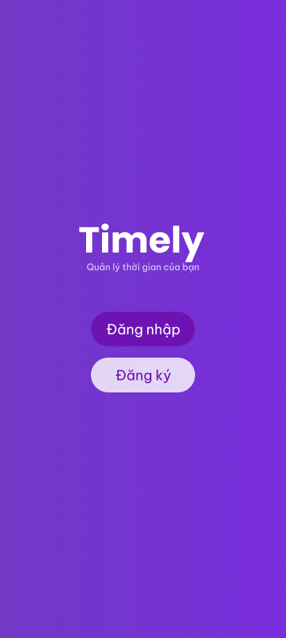
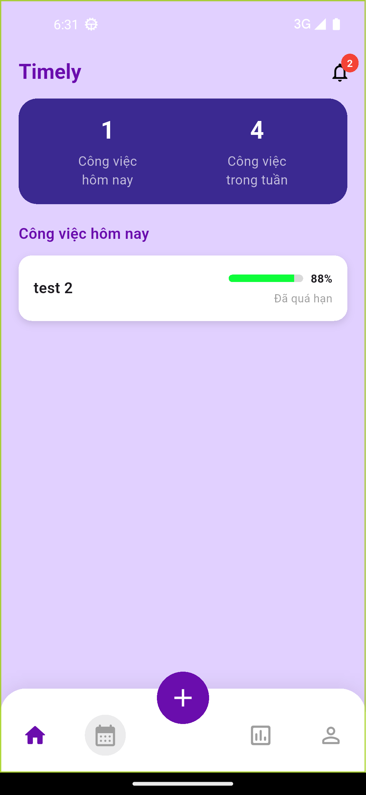
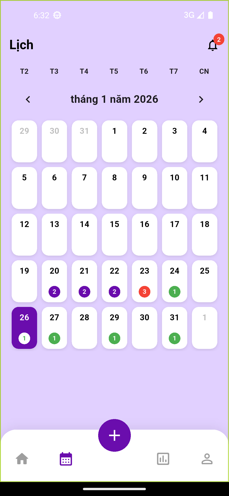
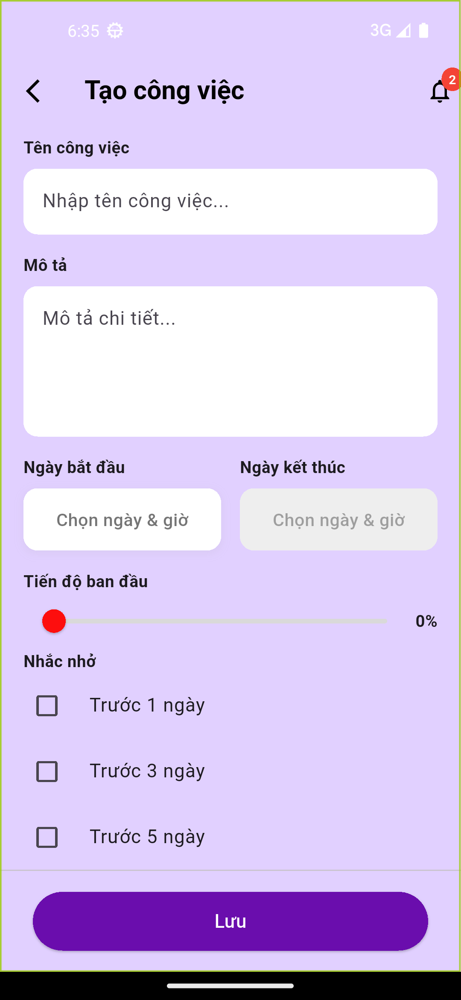
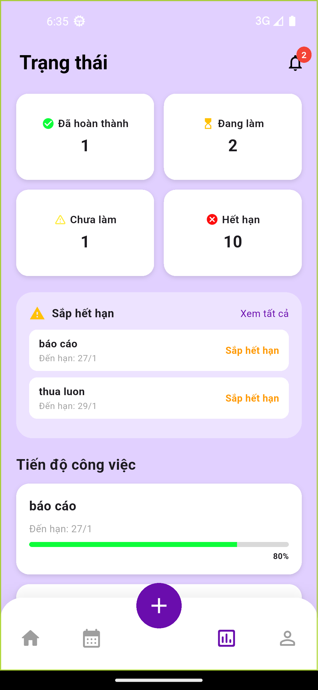

# Timely

<p align="center">
  
</p>

## Tổng quan

## 1. Lựa chọn đề tài

### 🎯 Quy trình & Lý do

- **Đề tài:** Deadline Tracker App.
- **Động lực phát triển:**
  - Xuất phát từ nhu cầu thực tế của nhóm: Là sinh viên, các thành viên thường xuyên gặp tình trạng trễ hạn (deadline), quên bài tập, hoặc bị rối khi khối lượng công việc từ nhiều môn học dồn lại cùng lúc.
  - **Mục tiêu:** Xây dựng một ứng dụng nhắc nhở và theo dõi tiến độ công việc, phục vụ trực tiếp cho nhu cầu cá nhân và cộng đồng sinh viên.

---

## 2. Lên ý tưởng (Ideation)

### 🎨 Định hướng thiết kế

Nhóm hướng đến tiêu chí **"Gọn – Dễ nhìn – Dễ thao tác"**, giúp người dùng (đặc biệt là sinh viên) có thể cài đặt và sử dụng ngay mà không cần tốn thời gian làm quen.

- **Giao diện:** Tông màu Pastel Tím (Purple) chủ đạo, tạo cảm giác nhẹ nhàng, giảm căng thẳng khi nhìn vào danh sách công việc.
- **Trải nghiệm người dùng (UX):** Tối giản hóa các thao tác, tập trung vào tính trực quan.

### 💡 Các tính năng dự kiến

- **Dashboard (Home):** Hiển thị ngay các deadline trong ngày và danh sách công việc tổng quát.
- **Lịch tháng (Calendar):** Chọn ngày cụ thể để xem toàn bộ task của ngày đó.
- **Chi tiết Task:**
  - Thông tin: Tên, Mô tả, Ngày bắt đầu – Ngày kết thúc.
  - Phân loại: Mức độ ưu tiên được mã hóa bằng màu sắc.
  - **Tiến độ:** Thanh trượt (Slider) để cập nhật % hoàn thành công việc.
- **Hệ thống nhắc nhở:** Tùy chọn nhắc trước hạn (1 ngày, 3 ngày, 5 ngày...).
- **Cài đặt:** Tùy chỉnh hồ sơ cá nhân (Avatar, Tên, Đổi mật khẩu).

---

## 3. Nghiên cứu (Research)

### 3.1. Nghiên cứu nhu cầu người dùng

Qua khảo sát nhỏ trong lớp học, nhóm ghi nhận các vấn đề chung:

- Thường xuyên quên deadline hoặc không nắm rõ còn bao nhiêu ngày đến hạn.
- Không theo dõi được tiến độ thực hiện (đã làm được bao nhiêu %).
- **Kết luận:** Cần bổ sung tính năng **Thanh tiến độ (Progress Bar)** và **Lịch tháng** trực quan để giải quyết điểm yếu của các ứng dụng ghi chú đơn giản.

### 3.2. Phân tích đối thủ cạnh tranh

| Ứng dụng            | Ưu điểm                       | Nhược điểm đối với sinh viên                  |
| :------------------ | :---------------------------- | :-------------------------------------------- |
| **Todoist, Notion** | Rất mạnh mẽ, nhiều tính năng. | Phức tạp, tốn thời gian thiết lập (setup).    |
| **Google Tasks**    | Đơn giản, tích hợp tốt.       | Thiếu thanh theo dõi % tiến độ, ít tùy chỉnh. |

👉 **Hướng đi của nhóm:** Xây dựng ứng dụng dạng **"Mini App"** – cân bằng giữa sự đơn giản và đầy đủ tính năng cần thiết.

### 3.3. Lựa chọn công nghệ

Nhóm quyết định sử dụng **Flutter** với các lý do:

- **Đa nền tảng:** Chạy mượt mà trên cả Android và iOS.
- **UI/UX:** Khả năng tùy biến giao diện mạnh mẽ và dễ dàng.
- **Khả năng mở rộng:** Dễ dàng nâng cấp và bảo trì sau này.

---

## 4. Phân tích hệ thống

### 4.1. Phân tích chức năng

Ứng dụng được chia thành các phân hệ chính:

- **Quản lý Deadline (CRUD):** Thêm, Sửa, Xóa công việc.
- **Theo dõi tiến độ:** Cập nhật trạng thái hoàn thành theo phần trăm (%).
- **Lịch biểu:** Xem tổng quan deadline theo tháng/tuần.
- **Notification:** Hệ thống nhắc nhở linh hoạt theo mốc thời gian.
- **Bộ lọc & Thống kê:** Sắp xếp task theo mức độ ưu tiên, trạng thái, tiến độ.
- **Cài đặt cá nhân:** Quản lý thông tin tài khoản và bảo mật.

### 4.2. Phân tích tổng quan & Phạm vi

- **Cấu trúc dữ liệu:** Tập trung vào dữ liệu cá nhân (Personal Data), không yêu cầu chia sẻ phức tạp.
- **Hiển thị:** Deadline được thiết kế dạng thẻ (Card) với màu sắc định danh mức độ ưu tiên.
- **Phạm vi đồ án:** Ứng dụng phù hợp với yêu cầu môn học – không quá nặng về thuật toán phức tạp nhưng đảm bảo khối lượng công việc đầy đủ ở các khía cạnh: Thiết kế UI, Quản lý cơ sở dữ liệu, Xử lý Logic và Notification.

## 🛠 Tech Stack

### Languages & Framework


### Backend Services (Firebase)


### Key Libraries


### Tools & Environment


## ✨ Các tính năng chính

### 🔐 1. Xác thực người dùng (Authentication)

Hệ thống bảo mật và hỗ trợ nhiều phương thức đăng nhập:

- **Đăng ký & Đăng nhập:** Hỗ trợ tài khoản Email/Mật khẩu.
- **Google Sign-In:** Đăng nhập nhanh bằng tài khoản Google.
- **Quên mật khẩu:** Gửi liên kết đặt lại mật khẩu qua Email.
- **Đăng xuất:** Quản lý phiên làm việc an toàn.

### 📝 2. Quản lý công việc (Task Management)

Cho phép thao tác đầy đủ với công việc (CRUD):

- **Thêm mới:** Tạo công việc với tiêu đề, mô tả, thời gian bắt đầu và hạn chót (Deadline).
- **Xem chi tiết:** Hiển thị đầy đủ thông tin và tiến độ.
- **Cập nhật:** Chỉnh sửa nội dung, thời gian hoặc thay đổi trạng thái.
- **Xóa:** Xóa công việc khỏi hệ thống lưu trữ.

### 📊 3. Theo dõi trạng thái (Status Tracking)

Phân loại công việc theo **5 trạng thái** giúp quản lý tiến độ hiệu quả:

- ⚪ **Chưa làm:** Công việc mới khởi tạo.
- 🟡 **Đang làm:** Đang trong quá trình thực hiện.
- 🟢 **Đã làm:** Đã hoàn thành nhiệm vụ.
- 🟠 **Sắp tới hạn:** Cảnh báo các việc sắp đến deadline.
- 🔴 **Hết hạn:** Các việc đã quá hạn xử lý.
- **Bộ lọc (Filter):** Xem nhanh danh sách công việc theo từng trạng thái cụ thể.

### 📅 4. Lịch biểu (Calendar View)

- Tích hợp giao diện Lịch (Calendar) trực quan.
- Xem danh sách công việc theo **Ngày** và **Tháng** để dễ dàng lập kế hoạch.

### 🔔 5. Hệ thống nhắc nhở (Smart Notifications)

Sử dụng Local Notification để đảm bảo không quên việc:

- **Thông báo đúng giờ:** Nhắc nhở khi công việc bắt đầu hoặc sắp đến hạn.
- **Tự động đồng bộ:** Tự động thêm, cập nhật hoặc hủy lịch nhắc nhở ngay khi người dùng thao tác trên công việc (Thêm/Sửa/Xóa).

### 👤 6. Cá nhân hóa (Profile)

- Xem và chỉnh sửa thông tin hồ sơ người dùng.
- Dữ liệu được lưu trữ riêng biệt theo từng tài khoản.

---

## 📁 Cấu Trúc Dự Án

```
lib/
├── core/
│   ├── navigation/         # Cấu hình điều hướng (Bottom Nav)
│   └── theme/              # Giao diện chung (Màu sắc, Font)
├── models/                 # Khuôn mẫu dữ liệu (DeadlineTask...)
├── repositories/           # Xử lý luồng dữ liệu (TaskRepository)
├── services/               # Gọi API & Firebase (Auth, Notification)
└── screens/                # Giao diện người dùng (UI)
    ├── auth/               # Đăng nhập, Đăng ký, Splash
    ├── calendar/           # Các màn hình xem Lịch (Tháng/Tuần)
    ├── home/               # Màn hình trang chủ
    ├── notifications/      # Màn hình thông báo
    ├── profile/            # Quản lý hồ sơ cá nhân
    ├── stats/              # Thống kê & Danh sách trạng thái
    └── task/               # Tạo, Sửa, Xem chi tiết công việc
```

## Demo Screenshot

<p align="center">
  
  
  
  
</p>
<p align="center">
  
